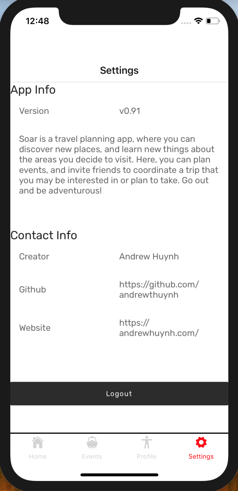

# Soar

## About

Soar is a cross-platform travel planning app, where you can discover new places, learn different cultures, and meet people from around the world. You decide the places you want to visit and we'll provide a list of interesting events to plan your travels around. Then, invite friends and coordinate the trip that you've been excited about. Go out and be adventurous!

Fully developed by Andrew Huynh

## Screenshots

## Tools

### Frontend
1. [React Native](https://facebook.github.io/react-native/)
2. [Shoutem UI Toolkit](https://shoutem.github.io/docs/ui-toolkit/introduction)
3. [React-redux](https://github.com/reduxjs/react-redux)
4. [axios](https://github.com/axios/axios)

### Backend
1. [Node.js](https://nodejs.org/en/)
2. [Mongoose](https://mongoosejs.com/)
3. [Express](https://expressjs.com/)
# CookThisNotThat
