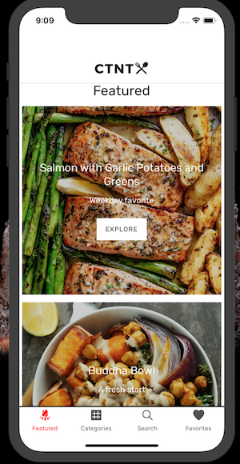

# CookThisNotThat

## About

CookThisNotThat is a recipe app created around creating meals that fit your dietary needs and restrictions. Don't like a particular ingredient? We'll provide alternatives that we have hand-picked to fill its place.

## Screenshots

## Tools

### Frontend
1. [React Native](https://facebook.github.io/react-native/)
2. [Shoutem UI Toolkit](https://shoutem.github.io/docs/ui-toolkit/introduction)
3. [axios](https://github.com/axios/axios)

### Backend
1. [Node.js](https://nodejs.org/en/)
2. [Mongoose](https://mongoosejs.com/)
3. [Express](https://expressjs.com/)
